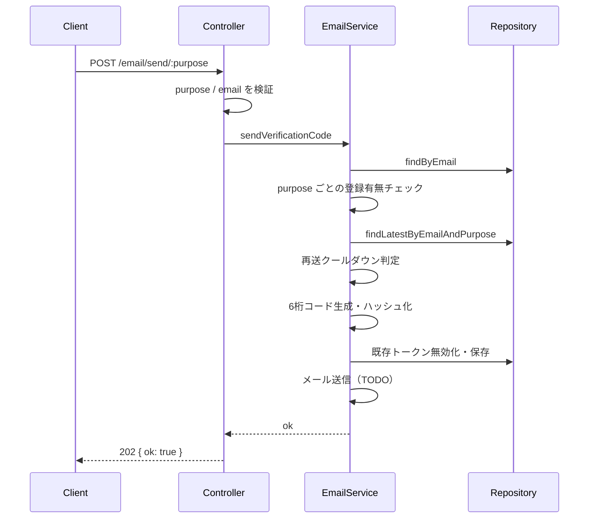
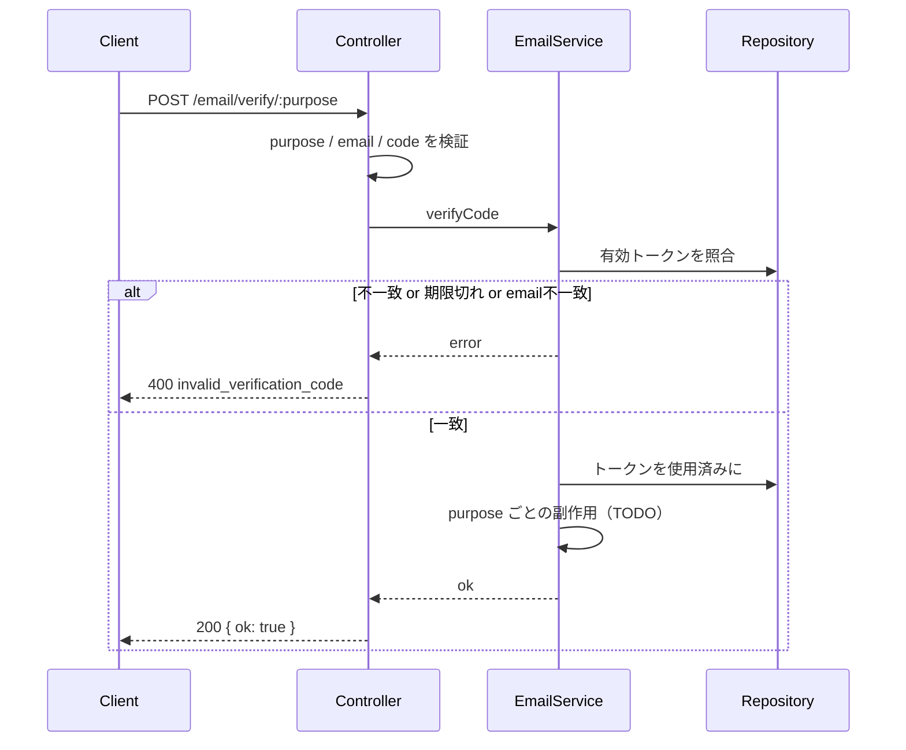

# メール認証 API

`POST /email/send/:purpose` と `POST /email/verify/:purpose` の処理フロー。

`:purpose` は次のいずれか。

| purpose | 用途 |
|---------|------|
| `register` | ユーザー登録 |
| `email-change` | メールアドレス変更 |
| `password-reset` | パスワードリセット |
| `unlock` | ユーザーロック解除 |

---

## 共通レイヤー

```
Route → Controller → Service → Repository
```

1. **Controller** — `purpose` / body の検証
2. **Service** — メール登録有無・送信可否判定、コード生成・検証
3. **Repository** — ユーザー・トークンの永続化

---

## 認証コード送信

`POST /email/send/:purpose`

**Body:** `{ "email": string }`



### メール登録有無チェック

| purpose | 条件 | 失敗時 |
|---------|------|--------|
| `register` | **未登録**であること | `409 email_already_registered` |
| `email-change` | 変更先が **未登録**であること | `409 email_already_registered` |
| `password-reset` | **登録済み**であること | `404 email_not_registered` |
| `unlock` | **登録済み**かつ **ロック中** (`lockedAt` あり) | `404` / `400 user_not_locked` |

### トークン送信可否

次をすべて満たすとき送信可能。

1. 上記の登録有無チェックを通過している
2. 同一 `email` + `purpose` の直近トークンから **60秒以上**経過している  
   - 未経過なら `429 token_send_not_allowed`

通過後の処理:

1. 6桁コードを生成し SHA-256 ハッシュを保存（平文は保存しない）
2. 同 `email` + `purpose` の未使用トークンを無効化
3. 有効期限 **10分** のトークンを作成
4. メール送信（未実装）

---

## 認証コード検証

`POST /email/verify/:purpose`

**Body:** `{ "email": string, "code": string }`



**検証処理（実装済み）**

1. コードをハッシュ化し、`purpose` + ハッシュで有効トークンを検索
2. トークンの `email` がリクエストと一致すること
3. 一致したら使用済みにする

**purpose ごとの副作用（未実装 → 501）**

| purpose | 検証成功後 |
|---------|------------|
| `register` | メール確認済みにする（本登録の続きへ） |
| `email-change` | ユーザーのメールを新アドレスへ更新 |
| `password-reset` | パスワード再設定を許可 |
| `unlock` | アカウントロックを解除 |

---

## 定数

| 項目 | 値 |
|------|-----|
| コード桁数 | 6 |
| 有効期限 | 10分 |
| 再送クールダウン | 60秒 |

---

## 補足

- コード生成: `shared/createRandomCode`
- ハッシュ: `shared/hashVerificationCode`（SHA-256）
- `email-change` の「ログイン必須」は今後ミドルウェアで担保する
