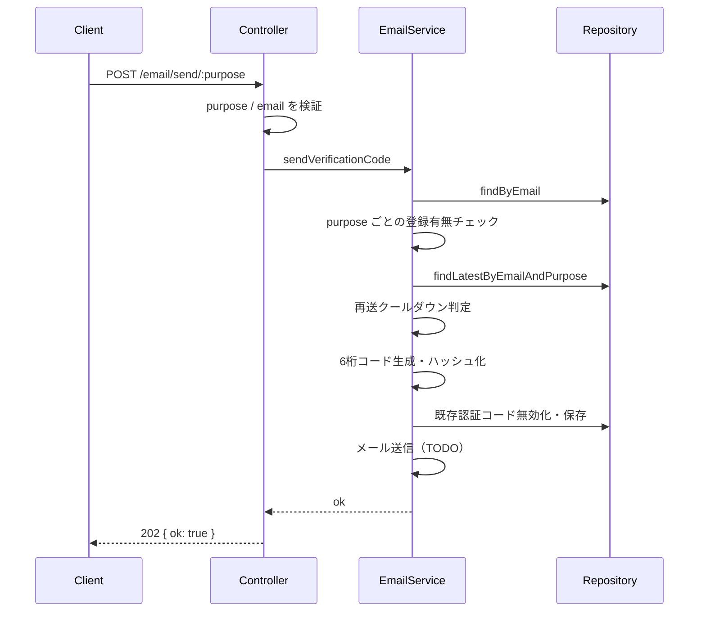
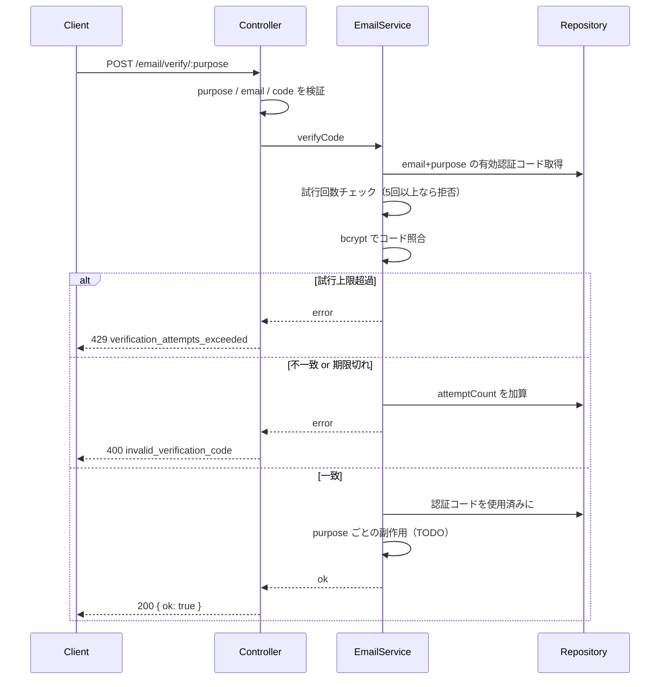

# メール認証 API

`POST /email/send/:purpose` と `POST /email/verify/:purpose` の処理フロー。

`:purpose` は次のいずれか。

| purpose | 用途 |
|---------|------|
| `register` | ユーザー登録 |
| `email-change` | メールアドレス変更 |
| `password-reset` | パスワードリセット |
| `unlock` | ユーザーロック解除 |

認証コードの永続化レコード型 `EmailCode` とリポジトリは `repositories/email-code` が担当する。  
JWT などのセッショントークンとは別物。

---

## 共通レイヤー

```
Route → Controller → Service → Repository
```

1. **Controller** — `purpose` / body の検証
2. **Service** — メール登録有無・送信可否判定、コード生成・検証
3. **Repository** — ユーザー・認証コードの永続化

---

## 認証コード送信

`POST /email/send/:purpose`

**Body:** `{ "email": string }`



### メール登録有無チェック

| purpose | 条件 | 失敗時 |
|---------|------|--------|
| `register` | **未登録**であること | `409 email_already_registered` |
| `email-change` | 変更先が **未登録**であること | `409 email_already_registered` |
| `password-reset` | **登録済み**であること | `404 email_not_registered` |
| `unlock` | **登録済み**かつ **ロック中** (`lockedAt` あり) | `404` / `400 user_not_locked` |

### 認証コード送信可否

次をすべて満たすとき送信可能。

1. 上記の登録有無チェックを通過している
2. 同一 `email` + `purpose` の直近認証コードから **60秒以上**経過している  
   - 未経過なら `429 token_send_not_allowed`

通過後の処理:

1. 6桁コードを生成し bcrypt でハッシュして保存（平文は保存しない）
2. 同 `email` + `purpose` の未使用認証コードを無効化
3. 有効期限 **10分** の認証コードを作成
4. メール送信（未実装）

---

## 認証コード検証

`POST /email/verify/:purpose`

**Body:** `{ "email": string, "code": string }`



**検証処理（実装済み）**

1. `email` + `purpose` の直近認証コードを取得（未使用・期限内）
2. `attemptCount >= 5` なら `429 verification_attempts_exceeded`
3. 平文コードを bcrypt で照合
4. 不一致なら `attemptCount` を +1 して `400 invalid_verification_code`
5. 一致したら使用済みにする

**purpose ごとの副作用（未実装 → 501）**

| purpose | 検証成功後 |
|---------|------------|
| `register` | メール確認済みにする（本登録の続きへ） |
| `email-change` | ユーザーのメールを新アドレスへ更新 |
| `password-reset` | パスワード再設定を許可 |
| `unlock` | アカウントロックを解除 |

---

## 定数

| 項目 | 値 |
|------|-----|
| コード桁数 | 6 |
| 有効期限 | 10分 |
| 再送クールダウン | 60秒 |
| 検証最大試行回数 | 5回 |

---

## 補足

- コード生成: `shared/createRandomCode`
- ハッシュ / 照合: `shared/hashSecret` / `shared/verifySecret`（bcrypt）
  - 一方向ハッシュのため復号は不可。照合のみ行う
  - 認証コード・パスワード・アクセストークン等で共通利用する想定
- `email-change` の「ログイン必須」は今後ミドルウェアで担保する
