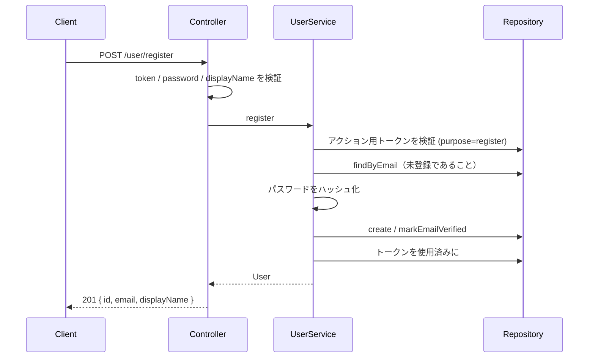

# ユーザー API

## 本登録

`POST /user/register`

メール認証コード検証（`POST /email/verify/register`）で得たアクション用トークンを使い、ユーザーを作成する。

**Body:** `{ "token": string, "password": string, "displayName": string }`

メールアドレスはトークンに紐づく値を使う（body では受け取らない）。

### 失敗時

| 条件 | レスポンス |
|------|------------|
| token / password / displayName 欠落 | `400` |
| トークン無効・期限切れ・purpose 不一致 | `400 invalid_email_token` |
| メールが既に登録済み | `409 email_already_registered` |

### 前提フロー

1. `POST /email/send/register` `{ email }`
2. `POST /email/verify/register` `{ email, code }` → `{ token }`
3. `POST /user/register` `{ token, password, displayName }`

---

## その他（未実装）

| メソッド | パス | 状態 |
|----------|------|------|
| POST | `/user/login` | 501 |
| POST | `/user/logout` | 501 |
